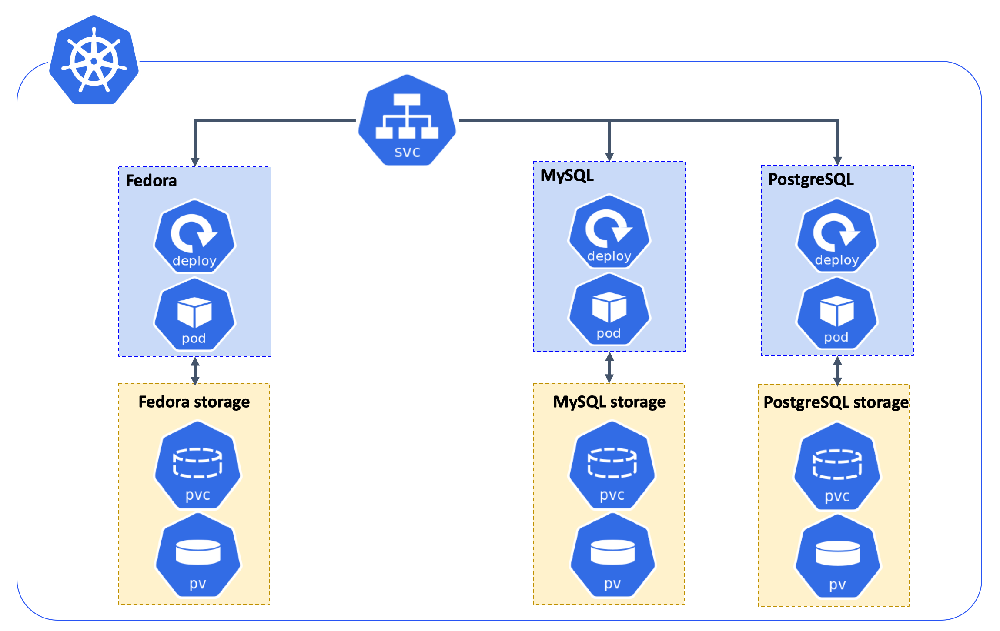

# Deploy Fedora in Kubernetes

## Architecture



## Requirements

* [Kubernetes](https://kubernetes.io/) cluster
	* [Google Cloud - Kubernetes Engine](https://cloud.google.com/kubernetes-engine/)
	* [Amazon Elastic Container Service for Kubernetes](https://aws.amazon.com/eks/)

## Deployment
* Deploy Fedora with a file-based objects database:
	* Allocate 10GB storage for Fedora server
	* Mount /mnt/data on the cluster’s Node.
	```
	kubectl create -f deployments/fcrepo.yaml
	```

* Deploy Fedora with a MySQL database:
	* Allocate 10GB storage for Fedora server
	* Mount /mnt/data on the cluster’s Node.
	* Allocate 10GB storage for MySQL database
	* Mount /mnt/db on the cluster’s Node.
	```
	kubectl create -f deployments/fcrepo-mysql.yaml
	```

* Deploy Fedora with a PostgreSQL database:
	* Allocate 10GB storage for Fedora server
	* Mount /mnt/data on the cluster’s Node.
	* Allocate 10GB storage for PostgreSQL database
	* Mount /mnt/db on the cluster’s Node.
	```
	kubectl create -f deployments/fcrepo-postgres.yaml
	```

* Deployment status
	```
	kubectl get deployment
	```

	```
	NAME     DESIRED   CURRENT   UP-TO-DATE   AVAILABLE   AGE
	fcrepo   1         1         1            1           15s
	```

* Get server external ip
	```
	kubectl get svc
	```

	```
	NAME         TYPE           CLUSTER-IP      EXTERNAL-IP   PORT(S)          AGE
	fcrepo       LoadBalancer   10.39.243.129   1.2.3.4   8080:31638/TCP   2m10s
	```

	Fedora server at [http://EXTERNAL-IP:8080/fcrepo](http://EXTERNAL-IP:8080/fcrepo)
	* username = "fedoraAdmin", password = "secret3"

* Delete all the deployments
	```
	kubectl delete -f deployments/fcrepo.yaml
	or
	kubectl delete -f deployments/fcrepo-mysql.yaml
	or
	kubectl delete -f deployments/fcrepo-postgres.yaml
	```

## Environment
* [Tomcat 8.x](http://tomcat.apache.org)
    * Available at:  [http://localhost:8080/manager/html](http://localhost:8080/manager/html)
    * Manager username = "fedora4", password = "fedora4"
* [Fedora 5.x](http://fedorarepository.org)
	* Available at: [http://localhost:8080/fcrepo](http://localhost:8080/fcrepo)
	* Authentication/Authorization configuration detailed below

### Fedora Configuration
WebAC authorization is enabled on this Fedora installation.
The following three Fedora user accounts are available:
 * user account `testuser`, with password `password1`
 * user account `adminuser`, with password `password2`
 * admin account `fedoraAdmin` with the password `secret3`

### Camel Toolbox Customizations
An example of camel toolbox customizations. See [Camel](deployments/camel/readme.md) section.

## Maintainers
* [Yinlin Chen](https://github.com/yinlinchen)
